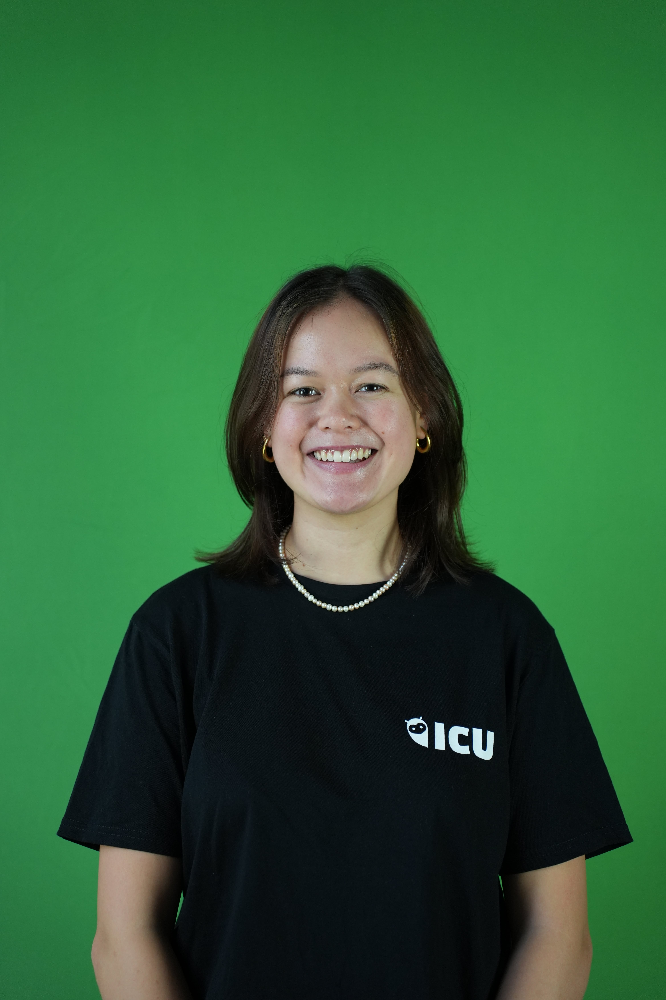

# Hi there, I'm Chiara!</h1>

This is a personal project of mine, where I am dabbling in web development and trying to create a first website myself.
I'm a second year Informatics and Social Sciences student at the University of Zurich. My major is Software Systems and my minor is a blend of history, society and politics.

## Background
After having grown up in Basel, I moved to Zurich two years ago for my studies. However, with my mother being from the Philippines and my father being from Canada, I have spent most of my life travelling a lot with family scattered all over the world.

Despite chosing a very maths-focussed academic path from middle school onwards, my true passion lay within philosophy and politics. Already in primary school I began being involved in local and school politics. This would later lead to my decision of interdisciplinary studies at university. 

## Studies
My path to Computer Science started barely two years ago, when I was already at university. Having first started a maths degree, I had to take an Introduction to Programming course, where I learnt the basics of Python. It was there that I did a basic program, which most will be very familiar with, for the first time: I printed "Hello World". Nothing more, nothing less. Soon after, I discovered that I enjoyed the magic of creating things and solving problems with just a few words and numbers on my laptop much more than I did calculations and proofs. So I switched to Computer Science. Even then, with no role models or much knowledge, I could not imagine majoring in it. I kept a Political Science major with an Informatics minor. Again, I quickly came to realise that I still enjoyed programming and all aspects of computer science more than I did learning about politics.
      
As much as I enjoyed the act of living politics! So with the support of my family and friends, I dared the switch to an Informatics major and have not regretted it since.

## Work
In the past, I have gathered experience working in gastronomie and service. However, since April 2024, I have been working at a local NGO in Zurich called Girls Code Too. Their mission is to motivate young girls to explore technology and bridge the gender gap in the tech industry. It has been a great pleasure teaching summer courses or in weekly after-school classes at local primary schools in Zurich. 

## Social engagement
Outside of my studies and work, I have the privilege of being able to invest my time into various social engagements in university life.

In autumn 2024, I joined the board of the Informatics Club (ICU) in the Studies position. After having received so much support and community from this association in my first year of my studies, I am even more excited to be able to give back from the other side. 

As part of my membership in the ICU, I am also a member in the student council of the UZH, the VSUZH (Verband der Studierenden Schweiz). The ICU is part of the second largest fraction (fvoec x ICU) in this council of 70 seats, having 14 seats shared with the economics association (fvoec). As of autumn 2024, after having been an active representative from almost a year, I took over the co-lead of the fraction together with a fellow co-lead from the fvoec. 
      
In spring 2024, together with fellow co-students, I founded the local task force of the University of Zurich as part of the Una Europa alliance. 

## Personal interests
I was an avid rower for almost 8 years of my life. Having just stopped dancing ballet at the Balletschule Theater Basel, I was in search of a new sport to fill my time at 13. This lead me to join the Basler Ruder-Club. As a rower, I won two medals at national level, once silver in the BW4x in 2018 and bronze in the W8+ in 2021. 

Now being in Zurich, I still am a member of my home rowing club in Basel. In my first year of university, I qualified for the annual Unipoly race in November 2023 between the UZH and ETH. The following summer 2024, together with nine other girls from the UZH and ETH, we participated in the European University Rowing Championships in Zagreb, Croatia. We got bronze, following closely behind the Germans and the Dutch.

Having semi-retired from professional rowing, I have been able to venture into various other sports. During 2024, I participated in my first cross-country ski marathon at the Engadiner and my first running marathon at the Zurich marathon. 

---

## Contact
- [Email me](mailto:chiara.wooldridge@gmail.com")
- [LinkedIn Profile](https://www.linkedin.com/in/chiara-wooldridge-ba9814264)
